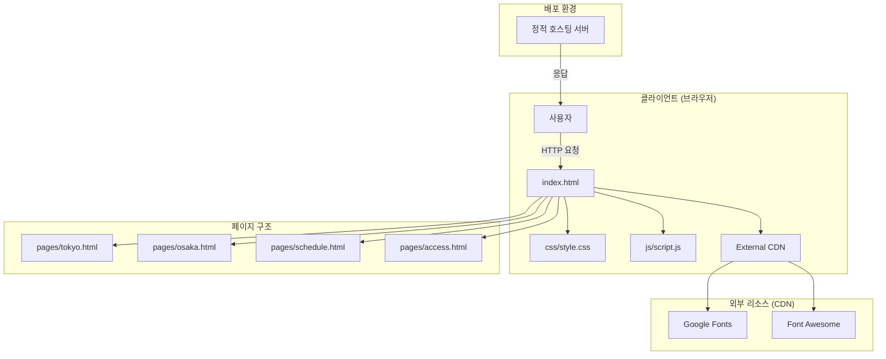
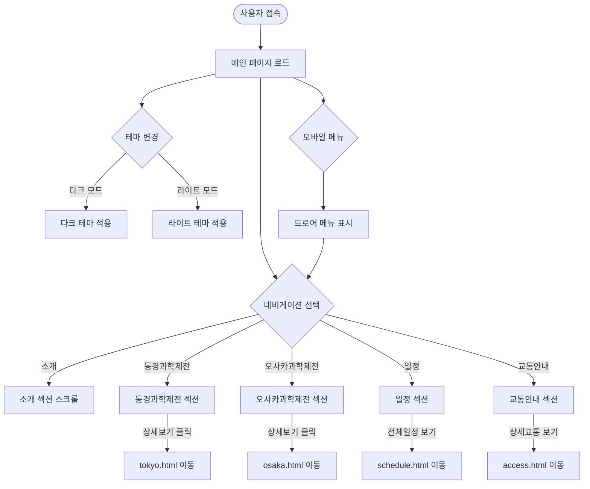
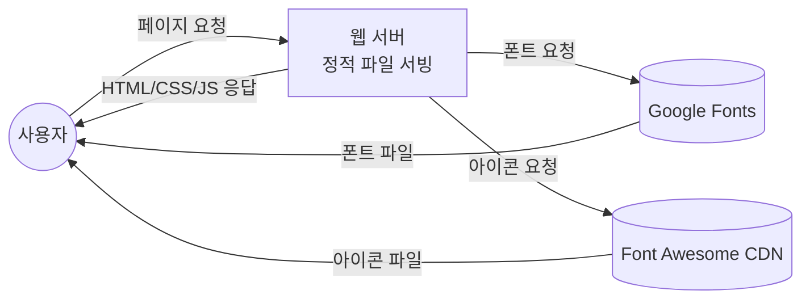
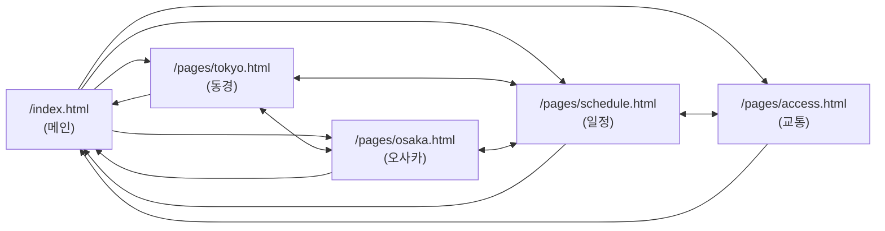
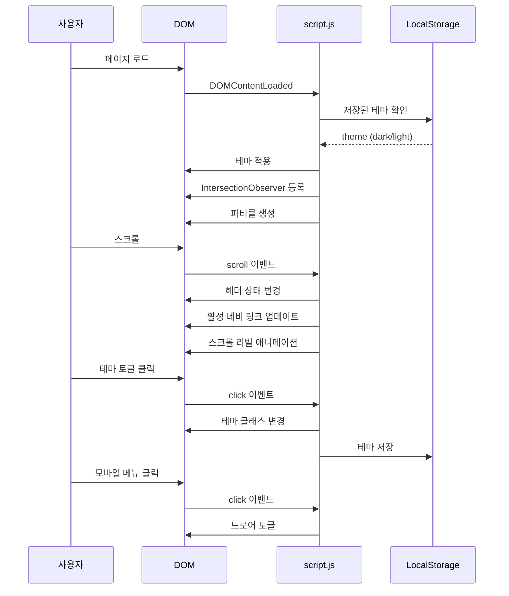

# 1-1. 시스템 흐름도

## 전체 시스템 아키텍처

```mermaid
graph TB
    subgraph CLIENT["클라이언트 (브라우저)"]
        A[사용자] -->|HTTP 요청| B[index.html]
        B --> C[css/style.css]
        B --> D[js/script.js]
        B --> E[External CDN]
    end

    subgraph PAGES["페이지 구조"]
        B --> F[pages/tokyo.html]
        B --> G[pages/osaka.html]
        B --> H[pages/schedule.html]
        B --> I[pages/access.html]
    end

    subgraph CDN["외부 리소스 (CDN)"]
        E --> J[Google Fonts]
        E --> K[Font Awesome]
    end

    subgraph HOSTING["배포 환경"]
        L[정적 호스팅 서버] -->|응답| A
    end
```

## 사용자 인터랙션 흐름도

```mermaid
flowchart TD
    START([사용자 접속]) --> HOME[메인 페이지 로드]
    HOME --> NAV{네비게이션 선택}
    
    NAV -->|소개| ABOUT[소개 섹션 스크롤]
    NAV -->|동경과학제전| TOKYO[동경과학제전 섹션]
    NAV -->|오사카과학제전| OSAKA[오사카과학제전 섹션]
    NAV -->|일정| SCHEDULE[일정 섹션]
    NAV -->|교통안내| ACCESS[교통안내 섹션]
    
    TOKYO -->|상세보기 클릭| TOKYO_PAGE[tokyo.html 이동]
    OSAKA -->|상세보기 클릭| OSAKA_PAGE[osaka.html 이동]
    SCHEDULE -->|전체일정 보기| SCHEDULE_PAGE[schedule.html 이동]
    ACCESS -->|상세교통 보기| ACCESS_PAGE[access.html 이동]
    
    HOME --> THEME{테마 변경}
    THEME -->|다크 모드| DARK[다크 테마 적용]
    THEME -->|라이트 모드| LIGHT[라이트 테마 적용]
    
    HOME --> MOBILE{모바일 메뉴}
    MOBILE --> DRAWER[드로어 메뉴 표시]
    DRAWER --> NAV
```

## 데이터 흐름도 (DFD Level 0)

```mermaid
flowchart LR
    USER((사용자)) -->|페이지 요청| WEB[웹 서버<br/>정적 파일 서빙]
    WEB -->|HTML/CSS/JS 응답| USER
    WEB -->|폰트 요청| GOOGLE[(Google Fonts)]
    WEB -->|아이콘 요청| FA[(Font Awesome CDN)]
    GOOGLE -->|폰트 파일| USER
    FA -->|아이콘 파일| USER
```

## 페이지 라우팅 흐름

```mermaid
graph LR
    INDEX["/index.html<br/>(메인)"] --> TOKYO["/pages/tokyo.html<br/>(동경)"]
    INDEX --> OSAKA["/pages/osaka.html<br/>(오사카)"]
    INDEX --> SCHEDULE["/pages/schedule.html<br/>(일정)"]
    INDEX --> ACCESS["/pages/access.html<br/>(교통)"]
    TOKYO --> INDEX
    OSAKA --> INDEX
    SCHEDULE --> INDEX
    ACCESS --> INDEX
    TOKYO <--> OSAKA
    TOKYO <--> SCHEDULE
    OSAKA <--> SCHEDULE
    SCHEDULE <--> ACCESS
```

## JavaScript 이벤트 흐름

```mermaid
sequenceDiagram
    participant U as 사용자
    participant DOM as DOM
    participant JS as script.js
    participant LS as LocalStorage

    U->>DOM: 페이지 로드
    DOM->>JS: DOMContentLoaded
    JS->>LS: 저장된 테마 확인
    LS-->>JS: theme (dark/light)
    JS->>DOM: 테마 적용

    JS->>DOM: IntersectionObserver 등록
    JS->>DOM: 파티클 생성

    U->>DOM: 스크롤
    DOM->>JS: scroll 이벤트
    JS->>DOM: 헤더 상태 변경
    JS->>DOM: 활성 네비 링크 업데이트
    JS->>DOM: 스크롤 리빌 애니메이션

    U->>DOM: 테마 토글 클릭
    DOM->>JS: click 이벤트
    JS->>DOM: 테마 클래스 변경
    JS->>LS: 테마 저장

    U->>DOM: 모바일 메뉴 클릭
    DOM->>JS: click 이벤트
    JS->>DOM: 드로어 토글
```
