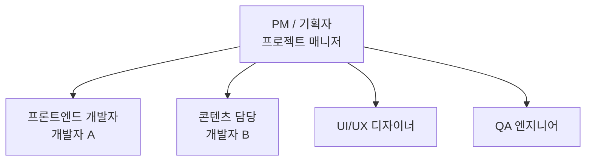

# 3. 업무분담 (담당업무)

## 팀 구성 및 역할 분담

### 조직도

## 상세 업무 분담표

| 담당자 | 역할 | 상세 업무 | 산출물 |
|--------|------|-----------|--------|
| **PM** | 프로젝트 관리 | • 프로젝트 일정 관리 • 요구사항 정의 및 관리 • 팀 간 커뮤니케이션 조율 • 완료보고서 총괄 | 프로젝트 기본정보, 요구사항 정의서, 업무분담표, 프로젝트 일정 |
| **디자이너** | UI/UX 설계 | • 디자인 시스템 구축 (색상, 타이포, 스페이싱) • 화면설계서 작성 • 반응형 브레이크포인트 설계 • 다크/라이트 테마 디자인 | 화면설계서, 디자인 시스템, 스타일 가이드 |
| **개발자 A** | 프론트엔드 개발 | • HTML 마크업 구현 • CSS 스타일시트 구현 • JavaScript 기능 구현 • 반응형 레이아웃 • 크로스 브라우저 테스트 | index.html, style.css, script.js, 서브페이지 4개 |
| **개발자 B** | 콘텐츠 관리 | • 동경/오사카 과학제전 정보 조사 • 행사 일정, 프로그램 정보 수집 • 교통 안내 정보 작성 • 이미지 자료 수집 | 콘텐츠 원고, 번역 자료, 이미지 자료 |
| **QA** | 품질 보증 | • 기능 테스트 (모든 링크, 버튼) • 반응형 테스트 (375/768/1024/1440px) • 크로스 브라우저 테스트 • 접근성 테스트 | 테스트 리포트, 버그 리스트 |

## 일정별 업무 배정

| 주차 | PM | 디자이너 | 개발자 A | 개발자 B | QA |
|------|-----|----------|----------|----------|-----|
| 1주차 | 요구사항 정의 | 디자인 리서치 | 개발환경 셋업 | 콘텐츠 조사 | 테스트 계획 |
| 2주차 | 설계 검토 | 화면설계 | HTML 마크업 | 콘텐츠 작성 | 테스트 케이스 |
| 3주차 | 진척 관리 | 디자인 QA | CSS/JS 구현 | 콘텐츠 검수 | 기능 테스트 |
| 4주차 | 완료보고서 | 최종 검수 | 버그 수정 | 최종 검수 | 종합 테스트 |
