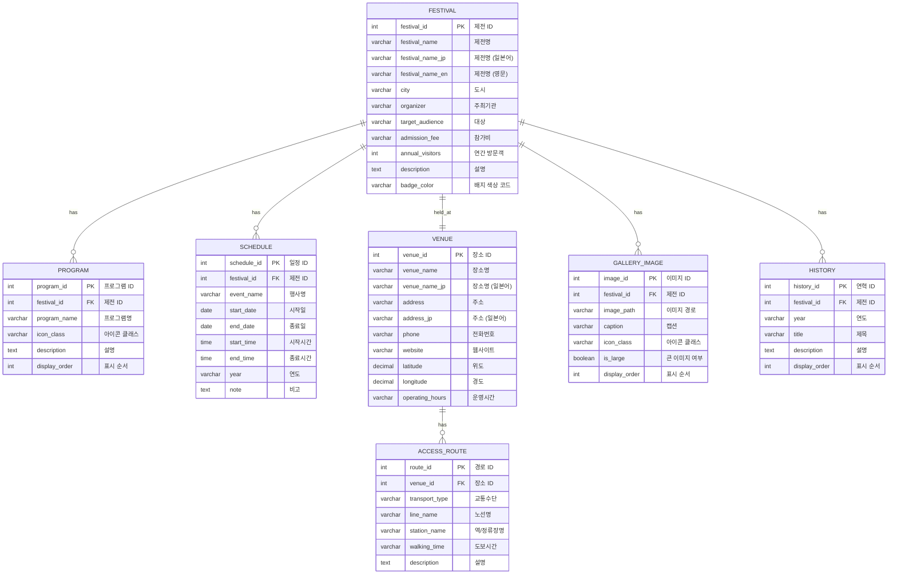

# 4-1. ERD 물리모드

## 개요

본 프로젝트는 순수 프론트엔드 정적 웹사이트로 RDBMS를 사용하지 않습니다.
그러나 콘텐츠의 논리적 데이터 구조를 ERD로 표현하여 향후 CMS 연동 또는 백엔드 확장 시 참고합니다.

## ERD (물리 모델)

## 테이블 관계 설명

| 관계 | 설명 | 카디널리티 |
|------|------|-----------|
| FESTIVAL → PROGRAM | 제전별 프로그램 | 1:N |
| FESTIVAL → SCHEDULE | 제전별 일정 | 1:N |
| FESTIVAL → VENUE | 제전별 개최 장소 | 1:1 |
| VENUE → ACCESS_ROUTE | 장소별 교통편 | 1:N |
| FESTIVAL → GALLERY_IMAGE | 제전별 갤러리 이미지 | 1:N |
| FESTIVAL → HISTORY | 제전별 연혁 | 1:N |
