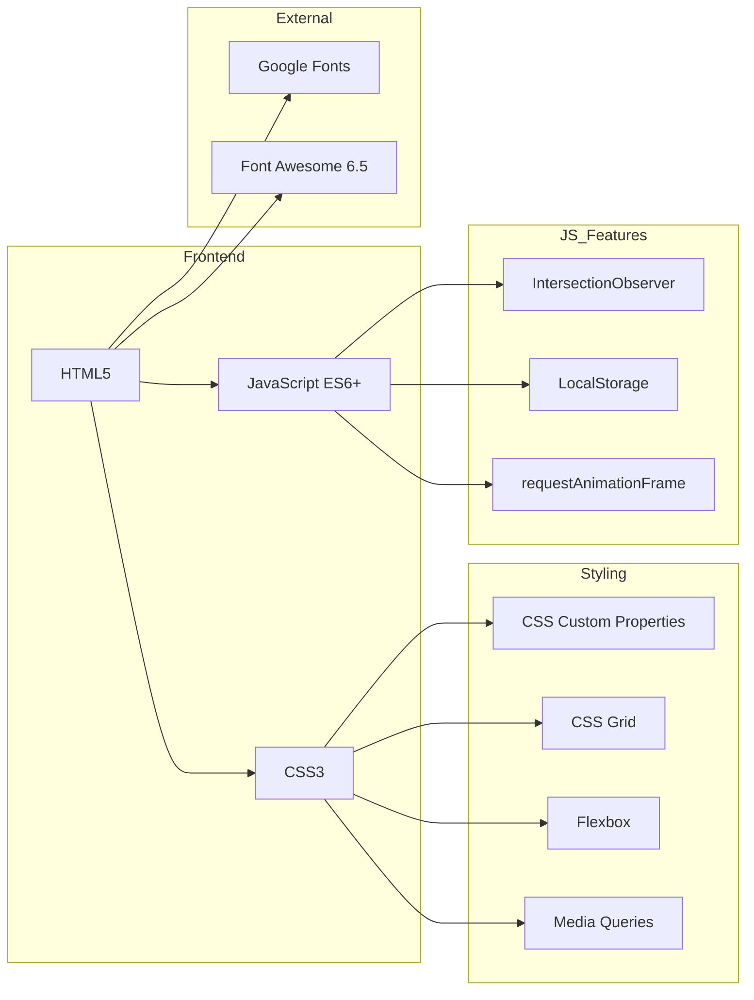

# 5. 개발환경

## 개발 환경 구성

### 하드웨어 환경

| 항목 | 사양 |
|------|------|
| **운영체제** | Windows 11 |
| **개발 PC** | Intel/AMD 프로세서, 16GB RAM |
| **디스플레이** | 1920x1080 이상 |

### 소프트웨어 환경

| 구분 | 도구 | 버전 | 용도 |
|------|------|------|------|
| **IDE** | Visual Studio Code | 1.90+ | 코드 편집 |
| **브라우저** | Google Chrome | 126+ | 개발/테스트 |
| **브라우저** | Mozilla Firefox | 128+ | 크로스브라우저 테스트 |
| **브라우저** | Microsoft Edge | 126+ | 크로스브라우저 테스트 |
| **브라우저** | Safari (macOS) | 17+ | 크로스브라우저 테스트 |
| **버전 관리** | Git | 2.40+ | 소스코드 버전 관리 |
| **AI 어시스턴트** | Gemini (Antigravity) | latest | 코드 생성/리뷰 |

### VS Code 확장 프로그램

| 확장 프로그램 | 용도 |
|--------------|------|
| Live Server | 로컬 개발 서버 |
| Prettier | 코드 포맷팅 |
| HTML CSS Support | HTML/CSS 자동완성 |
| Auto Rename Tag | HTML 태그 자동 수정 |
| Color Highlight | CSS 색상 미리보기 |

### 개발 서버 환경

| 항목 | 설정 |
|------|------|
| **로컬 서버** | VS Code Live Server (Port 5500) |
| **프로토콜** | HTTP (개발), HTTPS (배포) |
| **핫 리로드** | Live Server 자동 새로고침 |

### 배포 환경 (예정)

| 항목 | 설정 |
|------|------|
| **호스팅** | GitHub Pages / Netlify / Vercel |
| **도메인** | (미정) |
| **SSL** | 자동 (호스팅 플랫폼 제공) |
| **CDN** | Cloudflare (선택) |
| **CI/CD** | GitHub Actions (자동 배포) |

### 기술 스택 상세

