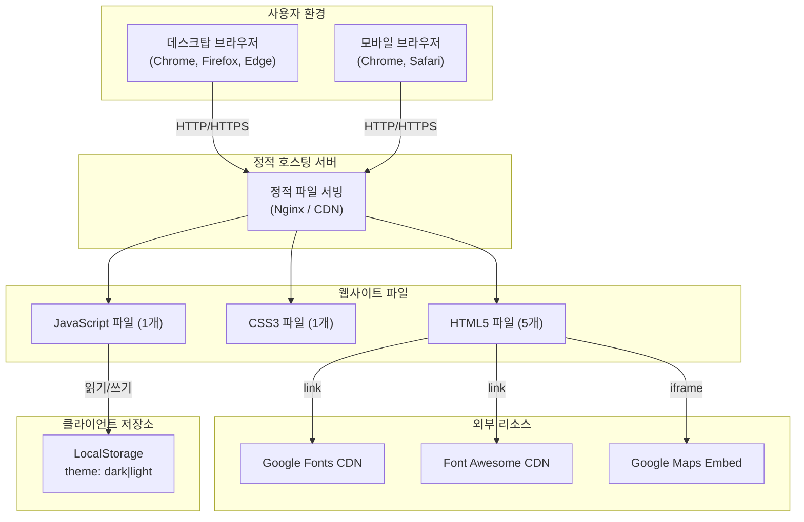
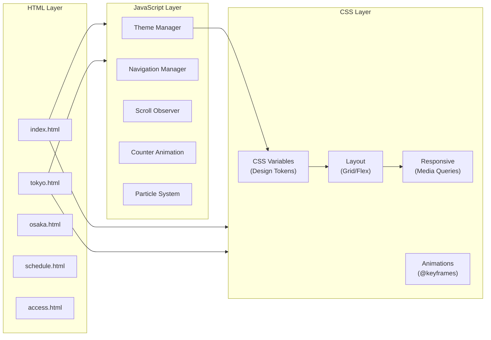
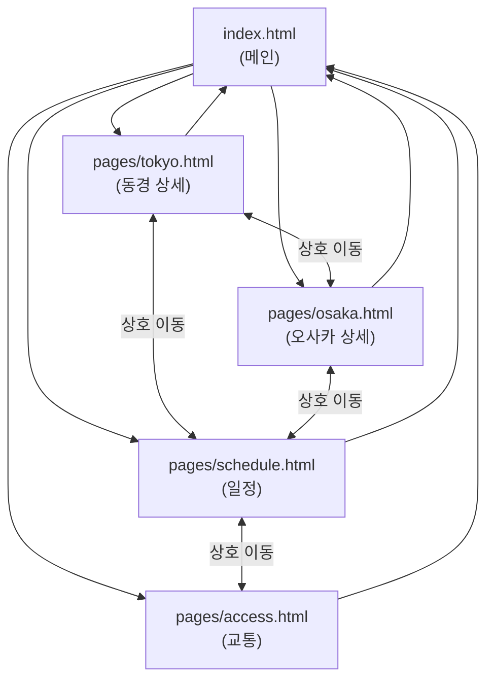
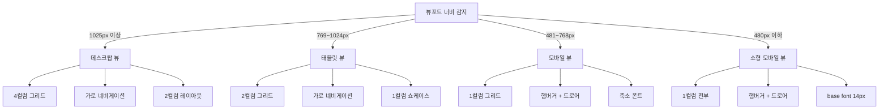

# 2. 시스템구조도(흐름도)

## 전체 시스템 구성도

```mermaid
graph TB
    subgraph USER["사용자 환경"]
        DESKTOP["데스크탑 브라우저<br/>(Chrome, Firefox, Edge)"]
        MOBILE["모바일 브라우저<br/>(Chrome, Safari)"]
    end

    subgraph SERVER["정적 호스팅 서버"]
        STATIC["정적 파일 서빙<br/>(Nginx / CDN)"]
    end

    subgraph FILES["웹사이트 파일"]
        HTML["HTML5 파일 (5개)"]
        CSS["CSS3 파일 (1개)"]
        JS["JavaScript 파일 (1개)"]
    end

    subgraph EXTERNAL["외부 리소스"]
        GFONT["Google Fonts CDN"]
        FAWESOME["Font Awesome CDN"]
        GMAP["Google Maps Embed"]
    end

    subgraph STORAGE["클라이언트 저장소"]
        LSKEY["LocalStorage<br/>theme: dark|light"]
    end

    DESKTOP -->|HTTP/HTTPS| STATIC
    MOBILE -->|HTTP/HTTPS| STATIC
    STATIC --> HTML
    STATIC --> CSS
    STATIC --> JS
    HTML -->|link| GFONT
    HTML -->|link| FAWESOME
    HTML -->|iframe| GMAP
    JS -->|읽기/쓰기| LSKEY
```

## 클라이언트 사이드 아키텍처

```mermaid
graph LR
    subgraph HTML_LAYER["HTML Layer"]
        INDEX["index.html"]
        TOKYO["tokyo.html"]
        OSAKA["osaka.html"]
        SCHED["schedule.html"]
        ACCESS["access.html"]
    end

    subgraph CSS_LAYER["CSS Layer"]
        VARS["CSS Variables<br/>(Design Tokens)"]
        LAYOUT["Layout<br/>(Grid/Flex)"]
        RESPONSIVE["Responsive<br/>(Media Queries)"]
        ANIMATION["Animations<br/>(@keyframes)"]
    end

    subgraph JS_LAYER["JavaScript Layer"]
        THEME["Theme Manager"]
        NAV["Navigation Manager"]
        SCROLL["Scroll Observer"]
        COUNTER["Counter Animation"]
        PARTICLE["Particle System"]
    end

    INDEX --> CSS_LAYER
    INDEX --> JS_LAYER
    TOKYO --> CSS_LAYER
    TOKYO --> JS_LAYER
    VARS --> LAYOUT
    LAYOUT --> RESPONSIVE
    THEME --> VARS
```

## 페이지 간 네비게이션 흐름

```mermaid
flowchart TD
    A["index.html<br/>(메인)"] --> B["pages/tokyo.html<br/>(동경 상세)"]
    A --> C["pages/osaka.html<br/>(오사카 상세)"]
    A --> D["pages/schedule.html<br/>(일정)"]
    A --> E["pages/access.html<br/>(교통)"]
    
    B --> A
    C --> A
    D --> A
    E --> A
    
    B <-->|상호 이동| C
    B <-->|상호 이동| D
    C <-->|상호 이동| D
    D <-->|상호 이동| E
```

## 반응형 동작 흐름

```mermaid
flowchart TD
    VIEWPORT["뷰포트 너비 감지"]
    VIEWPORT -->|1025px 이상| DESKTOP_VIEW["데스크탑 뷰"]
    VIEWPORT -->|769~1024px| TABLET_VIEW["태블릿 뷰"]
    VIEWPORT -->|481~768px| MOBILE_VIEW["모바일 뷰"]
    VIEWPORT -->|480px 이하| SMALL_VIEW["소형 모바일 뷰"]
    
    DESKTOP_VIEW --> D1["4컬럼 그리드"]
    DESKTOP_VIEW --> D2["가로 네비게이션"]
    DESKTOP_VIEW --> D3["2컬럼 레이아웃"]
    
    TABLET_VIEW --> T1["2컬럼 그리드"]
    TABLET_VIEW --> T2["가로 네비게이션"]
    TABLET_VIEW --> T3["1컬럼 쇼케이스"]
    
    MOBILE_VIEW --> M1["1컬럼 그리드"]
    MOBILE_VIEW --> M2["햄버거 + 드로어"]
    MOBILE_VIEW --> M3["축소 폰트"]
    
    SMALL_VIEW --> S1["1컬럼 전부"]
    SMALL_VIEW --> S2["햄버거 + 드로어"]
    SMALL_VIEW --> S3["base font 14px"]
```
