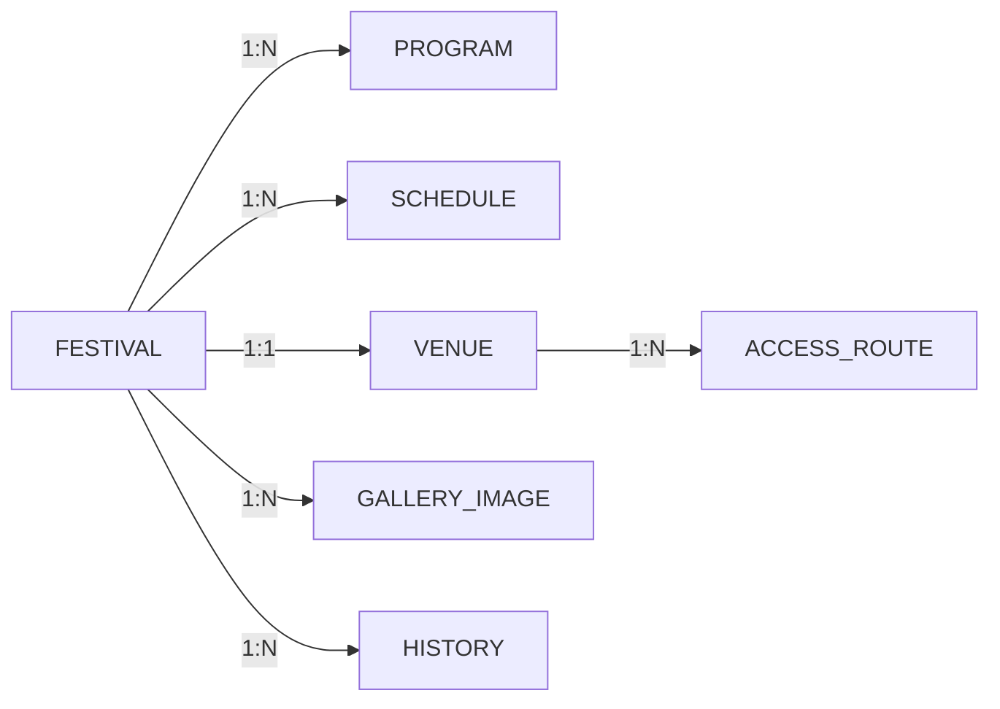

# 6. DB(객체) 목록

## 개요

본 프로젝트는 정적 웹사이트로 실제 RDBMS를 사용하지 않으나, 
향후 CMS/백엔드 확장을 위한 논리적 DB 객체 목록을 정의합니다.

## DB 객체 목록

| 번호 | 객체 유형 | 객체명 | 설명 | 비고 |
|------|----------|--------|------|------|
| 1 | TABLE | FESTIVAL | 제전 기본 정보 | 마스터 |
| 2 | TABLE | PROGRAM | 프로그램 정보 | FESTIVAL FK |
| 3 | TABLE | SCHEDULE | 일정 정보 | FESTIVAL FK |
| 4 | TABLE | VENUE | 장소 정보 | FESTIVAL 1:1 |
| 5 | TABLE | ACCESS_ROUTE | 교통편 정보 | VENUE FK |
| 6 | TABLE | GALLERY_IMAGE | 갤러리 이미지 | FESTIVAL FK |
| 7 | TABLE | HISTORY | 연혁 정보 | FESTIVAL FK |

## 객체 상세

### 1. FESTIVAL (제전)
- **역할**: 동경/오사카 과학제전의 기본 마스터 정보
- **PK**: festival_id (AUTO_INCREMENT)
- **레코드 수**: 2건 (동경, 오사카)

### 2. PROGRAM (프로그램)
- **역할**: 각 제전별 주요 프로그램 목록
- **PK**: program_id
- **FK**: festival_id → FESTIVAL
- **레코드 수**: 12건 (동경 6건 + 오사카 6건)

### 3. SCHEDULE (일정)
- **역할**: 제전별 행사 일정 정보
- **PK**: schedule_id
- **FK**: festival_id → FESTIVAL
- **레코드 수**: 3건 (봄 행사, 여름 행사, 가을 행사)

### 4. VENUE (장소)
- **역할**: 행사 개최 장소 정보
- **PK**: venue_id
- **FESTIVAL과 1:1 관계**
- **레코드 수**: 2건

### 5. ACCESS_ROUTE (교통편)
- **역할**: 장소까지의 교통 수단 정보
- **PK**: route_id
- **FK**: venue_id → VENUE
- **레코드 수**: 7건+ (동경 4건 + 오사카 3건)

### 6. GALLERY_IMAGE (갤러리)
- **역할**: 행사 갤러리 이미지
- **PK**: image_id
- **FK**: festival_id → FESTIVAL
- **레코드 수**: 5건

### 7. HISTORY (연혁)
- **역할**: 제전별 연혁 타임라인
- **PK**: history_id
- **FK**: festival_id → FESTIVAL
- **레코드 수**: 8건 (동경 4건 + 오사카 4건)

## 객체 관계도

