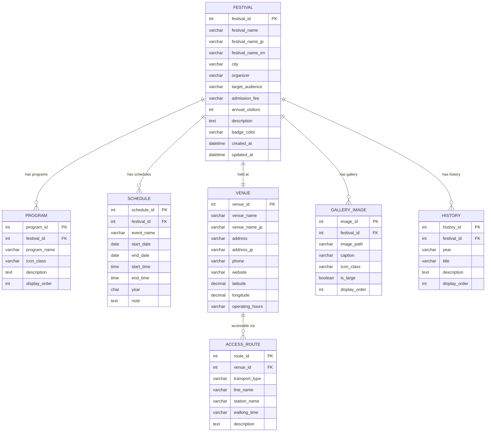

# 8. ERD

## Entity Relationship Diagram

## 관계 정의

| 부모 테이블 | 자식 테이블 | 관계 유형 | FK 컬럼 | 설명 |
|------------|------------|----------|---------|------|
| FESTIVAL | PROGRAM | 1:N | festival_id | 제전 → 프로그램 |
| FESTIVAL | SCHEDULE | 1:N | festival_id | 제전 → 일정 |
| FESTIVAL | VENUE | 1:1 | - | 제전 → 장소 |
| VENUE | ACCESS_ROUTE | 1:N | venue_id | 장소 → 교통편 |
| FESTIVAL | GALLERY_IMAGE | 1:N | festival_id | 제전 → 갤러리 |
| FESTIVAL | HISTORY | 1:N | festival_id | 제전 → 연혁 |

## 인덱스 정의

| 테이블 | 인덱스명 | 컬럼 | 유형 |
|--------|----------|------|------|
| FESTIVAL | PK_festival | festival_id | PRIMARY |
| PROGRAM | PK_program | program_id | PRIMARY |
| PROGRAM | FK_program_festival | festival_id | FOREIGN KEY |
| SCHEDULE | PK_schedule | schedule_id | PRIMARY |
| SCHEDULE | FK_schedule_festival | festival_id | FOREIGN KEY |
| SCHEDULE | IDX_schedule_year | year | INDEX |
| VENUE | PK_venue | venue_id | PRIMARY |
| ACCESS_ROUTE | PK_route | route_id | PRIMARY |
| ACCESS_ROUTE | FK_route_venue | venue_id | FOREIGN KEY |
| GALLERY_IMAGE | PK_gallery | image_id | PRIMARY |
| GALLERY_IMAGE | FK_gallery_festival | festival_id | FOREIGN KEY |
| HISTORY | PK_history | history_id | PRIMARY |
| HISTORY | FK_history_festival | festival_id | FOREIGN KEY |
