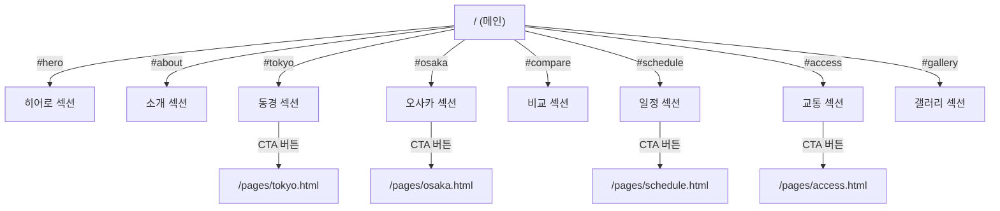

# 13. 화면경로

## 화면 경로 매핑

| 번호 | 화면명 | 경로 | 파일 위치 |
|------|--------|------|-----------|
| 1 | 메인 페이지 | `/` 또는 `/index.html` | `./index.html` |
| 2 | 동경과학제전 상세 | `/pages/tokyo.html` | `./pages/tokyo.html` |
| 3 | 오사카과학제전 상세 | `/pages/osaka.html` | `./pages/osaka.html` |
| 4 | 일정 안내 | `/pages/schedule.html` | `./pages/schedule.html` |
| 5 | 교통 안내 | `/pages/access.html` | `./pages/access.html` |

## 앵커(섹션) 경로

### index.html 내부 섹션

| 섹션명 | 앵커 경로 | 섹션 ID |
|--------|-----------|---------|
| 홈 (히어로) | `/#hero` | `#hero` |
| 소개 | `/#about` | `#about` |
| 동경과학제전 | `/#tokyo` | `#tokyo` |
| 오사카과학제전 | `/#osaka` | `#osaka` |
| 비교 | `/#compare` | `#compare` |
| 일정 | `/#schedule` | `#schedule` |
| 교통 안내 | `/#access` | `#access` |
| 갤러리 | `/#gallery` | `#gallery` |

## 네비게이션 경로 흐름

## 리소스 경로

| 리소스 유형 | 경로 | 참조 방식 |
|------------|------|-----------|
| 메인 CSS | `/css/style.css` | `<link>` |
| 서브페이지 CSS | `../css/style.css` | `<link>` (상대경로) |
| 메인 JS | `/js/script.js` | `<script>` |
| 서브페이지 JS | `../js/script.js` | `<script>` (상대경로) |
| Google Fonts | `https://fonts.googleapis.com/...` | CDN |
| Font Awesome | `https://cdnjs.cloudflare.com/...` | CDN |
