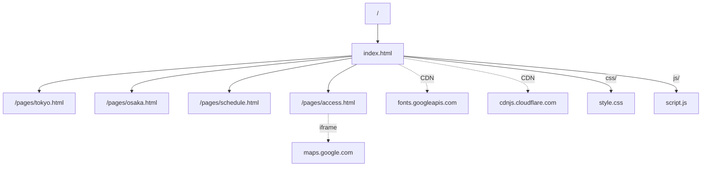

# 15. URI 매핑

## URI 매핑 테이블

| 번호 | URI | 파일 | HTTP Method | 설명 |
|------|-----|------|-------------|------|
| 1 | `/` | index.html | GET | 메인 페이지 |
| 2 | `/index.html` | index.html | GET | 메인 페이지 (명시적) |
| 3 | `/pages/tokyo.html` | pages/tokyo.html | GET | 동경과학제전 상세 |
| 4 | `/pages/osaka.html` | pages/osaka.html | GET | 오사카과학제전 상세 |
| 5 | `/pages/schedule.html` | pages/schedule.html | GET | 일정 안내 |
| 6 | `/pages/access.html` | pages/access.html | GET | 교통 안내 |
| 7 | `/css/style.css` | css/style.css | GET | 스타일시트 |
| 8 | `/js/script.js` | js/script.js | GET | JavaScript |

## 앵커(해시) 매핑

| URI | 대상 섹션 | 설명 |
|-----|----------|------|
| `/#hero` | `<section id="hero">` | 히어로 섹션 |
| `/#about` | `<section id="about">` | 소개 섹션 |
| `/#tokyo` | `<section id="tokyo">` | 동경과학제전 섹션 |
| `/#osaka` | `<section id="osaka">` | 오사카과학제전 섹션 |
| `/#compare` | `<section id="compare">` | 비교 섹션 |
| `/#schedule` | `<section id="schedule">` | 일정 섹션 |
| `/#access` | `<section id="access">` | 교통 섹션 |
| `/#gallery` | `<section id="gallery">` | 갤러리 섹션 |

## 외부 리소스 URI

| 리소스 | URI | 용도 |
|--------|-----|------|
| Google Fonts | `https://fonts.googleapis.com/css2?family=...` | 웹폰트 |
| Font Awesome | `https://cdnjs.cloudflare.com/ajax/libs/font-awesome/6.5.0/css/all.min.css` | 아이콘 |
| Google Maps (동경) | `https://www.google.com/maps/embed?pb=...` | 지도 임베드 |
| Google Maps (오사카) | `https://www.google.com/maps/embed?pb=...` | 지도 임베드 |
| Miraikan 웹사이트 | `https://www.miraikan.jst.go.jp/` | 외부 링크 |
| JST 웹사이트 | `https://www.jst.go.jp/` | 외부 링크 |
| 오사카시립과학관 | `https://www.sci-museum.jp/` | 외부 링크 |

## URI 흐름도

