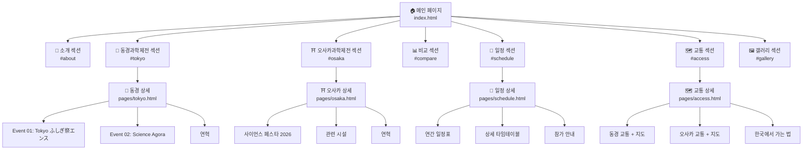

# 16. Sitemap

## 사이트맵



## 페이지 목록

| 레벨 | 페이지명 | URL | 비고 |
|------|----------|-----|------|
| 1 | 메인 페이지 | `/` | 8개 섹션 포함 |
| 2 | 동경과학제전 상세 | `/pages/tokyo.html` | 3개 섹션 |
| 2 | 오사카과학제전 상세 | `/pages/osaka.html` | 4개 섹션 |
| 2 | 일정 안내 | `/pages/schedule.html` | 3개 섹션 |
| 2 | 교통 안내 | `/pages/access.html` | 3개 섹션 |

## sitemap.xml

```xml
<?xml version="1.0" encoding="UTF-8"?>
<urlset xmlns="http://www.sitemaps.org/schemas/sitemap/0.9">
  <url>
    <loc>https://japan-science-festival.kr/</loc>
    <lastmod>2026-08-09</lastmod>
    <changefreq>monthly</changefreq>
    <priority>1.0</priority>
  </url>
  <url>
    <loc>https://japan-science-festival.kr/pages/tokyo.html</loc>
    <lastmod>2026-08-09</lastmod>
    <changefreq>monthly</changefreq>
    <priority>0.8</priority>
  </url>
  <url>
    <loc>https://japan-science-festival.kr/pages/osaka.html</loc>
    <lastmod>2026-08-09</lastmod>
    <changefreq>monthly</changefreq>
    <priority>0.8</priority>
  </url>
  <url>
    <loc>https://japan-science-festival.kr/pages/schedule.html</loc>
    <lastmod>2026-08-09</lastmod>
    <changefreq>monthly</changefreq>
    <priority>0.7</priority>
  </url>
  <url>
    <loc>https://japan-science-festival.kr/pages/access.html</loc>
    <lastmod>2026-08-09</lastmod>
    <changefreq>yearly</changefreq>
    <priority>0.7</priority>
  </url>
</urlset>
```
