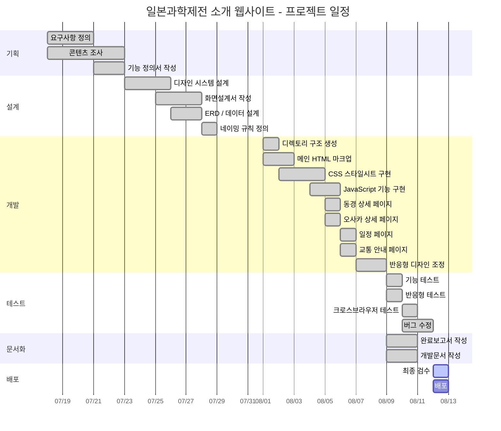

# 17. 프로젝트 상세일정

## 프로젝트 타임라인

### 전체 일정 (간트차트)

## 상세 일정표

### Week 1: 기획 (07.18 ~ 07.22)

| 날짜 | 업무 | 담당 | 산출물 | 상태 |
|------|------|------|--------|------|
| 07.18(금) | 프로젝트 킥오프, 요구사항 수집 | PM | 회의록 | ✅ |
| 07.19(토) | 동경/오사카 과학제전 조사 | 콘텐츠 | 조사 자료 | ✅ |
| 07.21(월) | 요구사항 정의서 작성 | PM | 요구사항 정의서 | ✅ |
| 07.22(화) | 기능 정의서 작성 | PM/개발자 | 기능정의서 | ✅ |

### Week 2: 설계 (07.23 ~ 07.29)

| 날짜 | 업무 | 담당 | 산출물 | 상태 |
|------|------|------|--------|------|
| 07.23(수) | 디자인 시스템 설계 | 디자이너 | 디자인 토큰 | ✅ |
| 07.25(금) | 화면설계서 작성 | 디자이너 | 화면설계서 | ✅ |
| 07.26(토) | ERD/데이터 설계 | 개발자 A | ERD, 테이블 구조 | ✅ |
| 07.28(월) | 네이밍 규칙 정의 | 개발자 A | 네이밍 규칙 | ✅ |

### Week 3: 개발 (08.01 ~ 08.08)

| 날짜 | 업무 | 담당 | 산출물 | 상태 |
|------|------|------|--------|------|
| 08.01(금) | 디렉토리 생성, HTML 마크업 시작 | 개발자 A | index.html 초안 | ✅ |
| 08.02(토) | HTML 마크업 완료 | 개발자 A | index.html 완성 | ✅ |
| 08.03(일) | CSS 스타일시트 구현 | 개발자 A | style.css | ✅ |
| 08.04(월) | CSS 완료, JS 기능 구현 | 개발자 A | style.css, script.js | ✅ |
| 08.05(화) | 동경/오사카 상세 페이지 | 개발자 A | tokyo.html, osaka.html | ✅ |
| 08.06(수) | 일정/교통 페이지 | 개발자 A | schedule.html, access.html | ✅ |
| 08.07(목) | 반응형 디자인 조정 | 개발자 A | 수정본 | ✅ |
| 08.08(금) | 최종 코드 정리 | 개발자 A | 최종본 | ✅ |

### Week 4: 테스트 및 문서화 (08.09 ~ 08.12)

| 날짜 | 업무 | 담당 | 산출물 | 상태 |
|------|------|------|--------|------|
| 08.09(토) | 기능/반응형 테스트, 문서 작성 | 전체 | 테스트 리포트, 문서 | ✅ |
| 08.10(일) | 크로스브라우저 테스트, 버그 수정 | QA/개발 | 수정본 | ✅ |
| 08.11(월) | 문서 최종 검수 | PM | 완료보고서, 개발문서 | ✅ |
| 08.12(화) | 최종 검수 및 배포 | 전체 | 배포 완료 | 🔄 |

## 마일스톤

| 마일스톤 | 예정일 | 달성 기준 | 상태 |
|---------|--------|----------|------|
| M1: 기획 완료 | 07.22 | 요구사항/기능 정의서 확정 | ✅ |
| M2: 설계 완료 | 07.29 | 화면설계서, ERD, 네이밍 확정 | ✅ |
| M3: 개발 완료 | 08.08 | 전 페이지 구현 완료 | ✅ |
| M4: 테스트 완료 | 08.11 | 버그 0건, 크로스브라우저 통과 | ✅ |
| M5: 프로젝트 완료 | 08.12 | 문서 + 배포 완료 | 🔄 |
